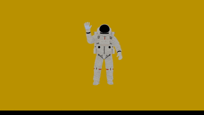
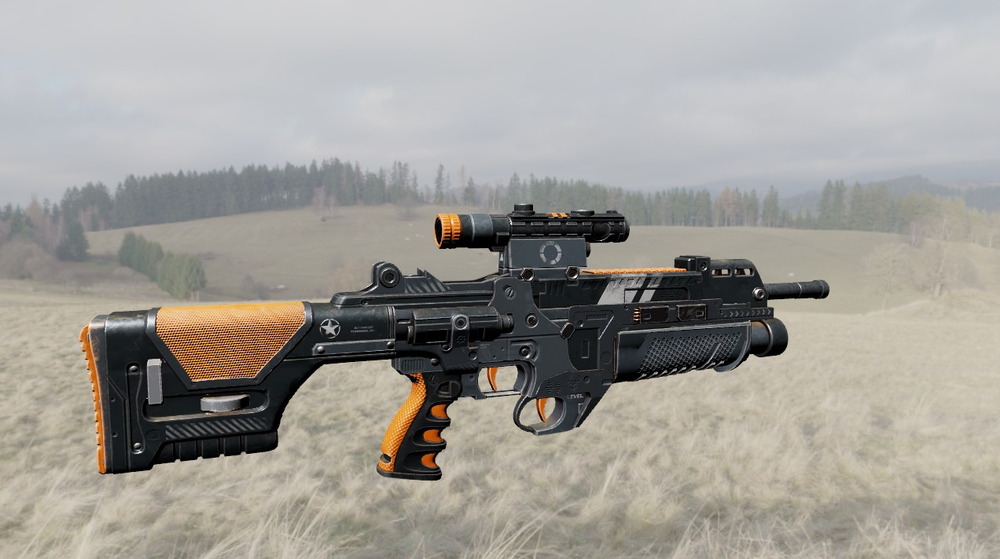
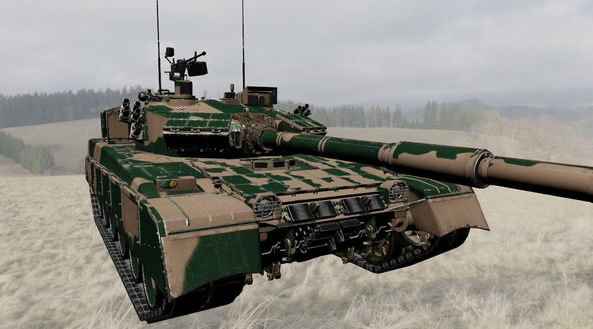
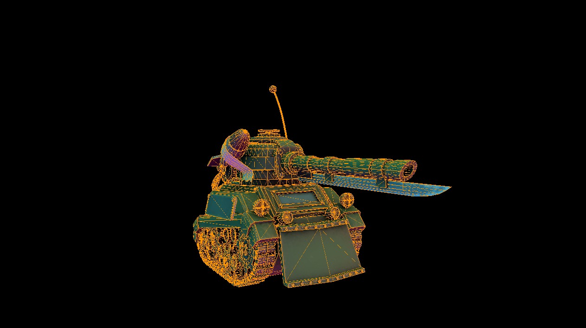
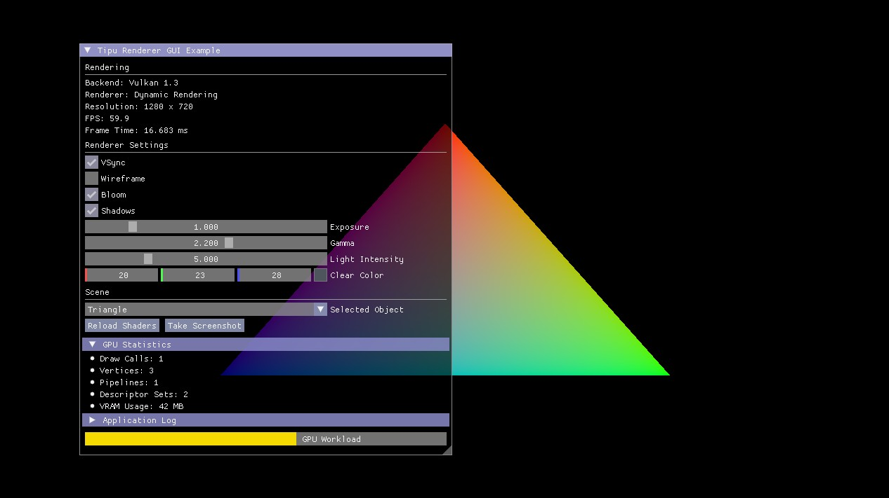
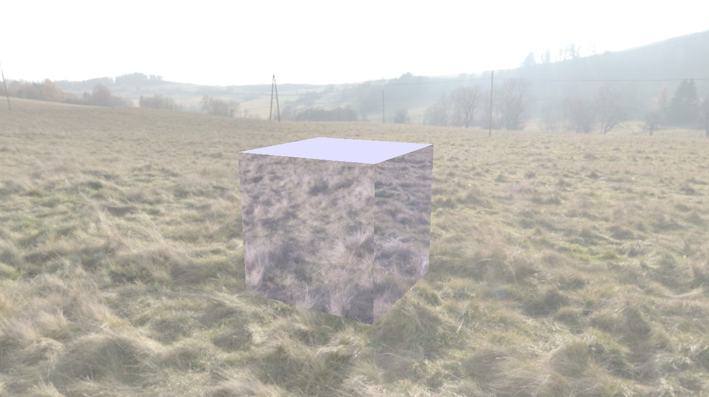

# Tipu Framework

Tipu is a lightweight rendering framework for Vulkan, designed to mimic SDL GPU and meta's Vulkan wrappers, it is
focused on ease of use and modern Vulkan features.

You can load and display models in less than 200 lines of code with this, chain up different render passes and
attachments.

<b>**Work In Progress**</b>

  
---

## Features

- Context management.
- Pipeline and layout builder helpers.
- Image layout state presistence.
- **Dynamic rendering**.
- **Buffer Device Address** (BDA) based push constant.
- **Bindless textures** support.
- Model loader helper.
- Material system.
- ImGui support.
- MSAA support.
- PBR examples.

## Technology

**Languages**: C++ 20, GLSL  
**Build System**: CMake  
**Asset Management**: [TinyGLTF](https://github.com/syoyo/tinygltf), [Shader-C](https://github.com/google/shaderc)  
**Third-Party
**: [Volk](https://github.com/zeux/volk), [VMA](https://github.com/GPUOpen-LibrariesAndSDKs/VulkanMemoryAllocator), [SDL3](https://github.com/libsdl-org/SDL), [GLM](https://github.com/g-truc/glm), [ImGui](https://github.com/ocornut/imgui)

---

## Examples

<b>Animation</b>

<b>PBR</b>

<b>Multi-Mesh Import</b>

<b>Wireframe</b>

<b>ImGui</b>

<b>Cubemap</b>

